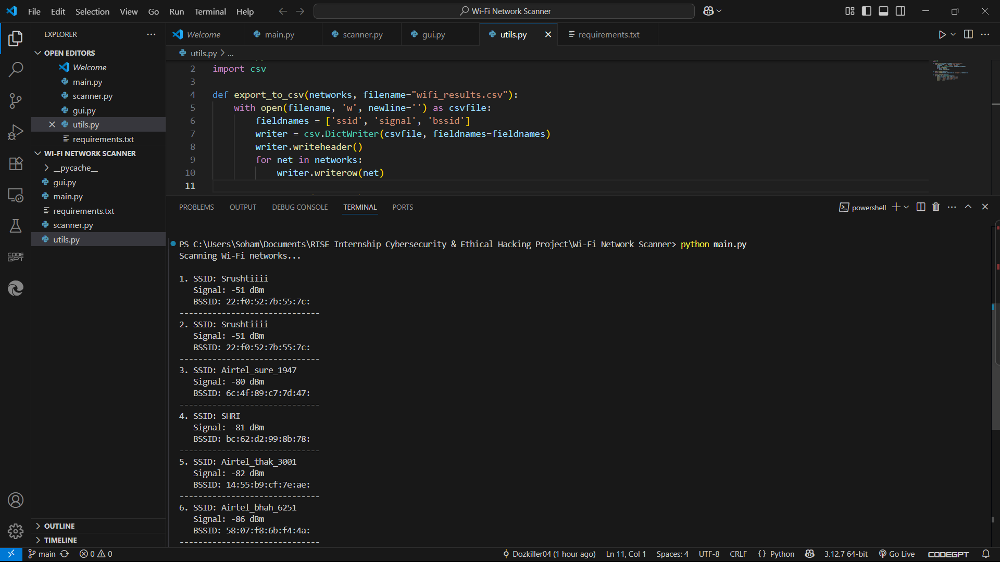
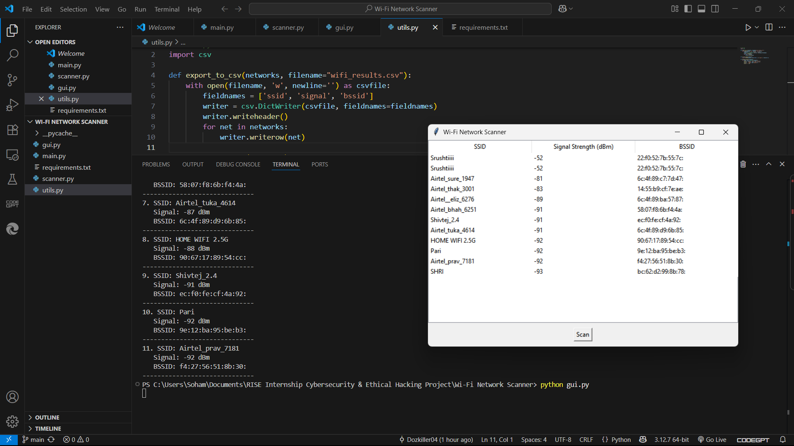

# 📶 Wi-Fi Network Scanner

A Python-based tool to scan nearby Wi-Fi networks and display essential information such as SSID, signal strength (dBm), and BSSID.  
This project helps users analyze signal quality and identify the best available network for connection.  
It supports both CLI and GUI modes and runs on Windows/Linux systems.

---

## ✨ Features

- 📡 Scans and lists nearby Wi-Fi networks
- 📶 Displays SSID, BSSID (MAC address), and signal strength (RSSI in dBm)
- 📊 Sorts networks by signal strength for easy comparison
- 💻 Provides both Command-Line Interface (CLI) and Graphical User Interface (GUI)
- 🧩 Cross-platform support: Works on Windows and Linux
- ⚡ Lightweight, fast, and easy to use

---

## 🛠️ Technologies Used

- 🐍 **Python 3.x** – Core programming language
- 📶 **pywifi** – For scanning available Wi-Fi networks
- 🪟 **tkinter** – Built-in GUI support for Python
- 🛠️ **subprocess** – Used for Linux command execution fallback

  ---

## 📁 Folder Structure
wifi-network-scanner/
├── main.py # CLI runner
├── scanner.py # Core scanning logic using pywifi
├── gui.py # GUI interface with Tkinter
├── utils.py # Utility functions
├── requirements.txt # Required Python packages
├── screenshots/ # Output screenshots
│ ├── Output_01.png # CLI output
│ └── GUI_Output_02.png # GUI output
└── README.md # Project documentation

---

## 📦 Installation Instructions

```bash
git clone https://github.com/Dozkiller04/Wi-Fi-Network-Scanner.git
cd Wi-Fi-Network-Scanner
pip install -r requirements.txt

💡 Note: tkinter is usually pre-installed with Python. If not, you may need to install it manually.
---

## ⚙️ How to Use

### ▶️ Run in CLI mode:
```bash
python main.py
-Run in GUI mode:
python gui.py

---

## 📸 Project Screenshots

### 🔹 CLI Interface Output  


### 🔹 GUI Interface Output  



---

## 🎬 Project Demo (with Voice-over)

📽️ **Watch the full video demo (with voice-over):**  
👉 [Click here to view demo on Google Drive](https://drive.google.com/file/d/1ugWrZr5Hl_Sy-oab5A3zvt5uaHNzHNUs/view?usp=drive_link)

---

## 🚀 Future Enhancements

- 🔄 Auto-refresh scanner every 10 seconds  
- 📶 Connect to selected networks directly from GUI  
- 📄 Export scanned results to CSV  
- 📊 Add signal strength chart using matplotlib  
- 🔐 Show Wi-Fi security type (WPA2, WPA3, Open)

---

## 👨‍💻 Author

**Soham Pramod Tayade**  
🎓 BSc Cyber & Digital Science  
🏢 RISE Internship – Cybersecurity & Ethical Hacking  
📍 Pune, Maharashtra  
🔗 GitHub: [Dozkiller04](https://github.com/Dozkiller04)


